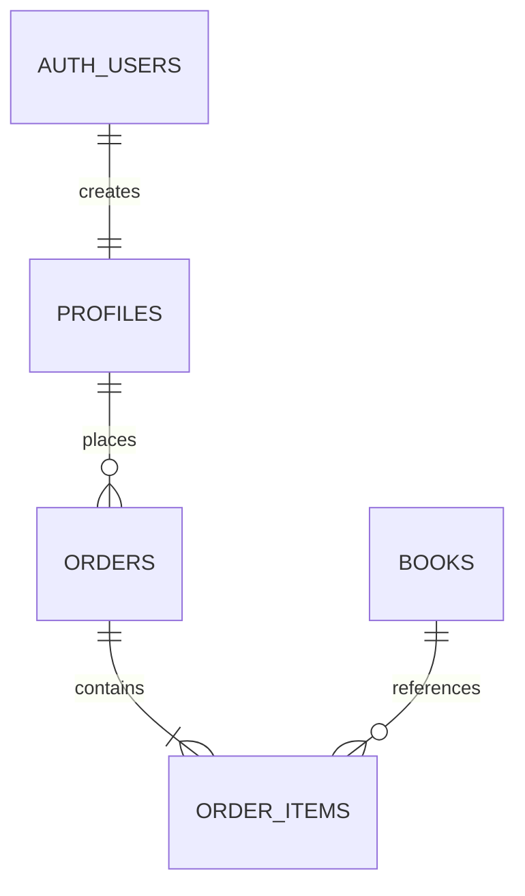
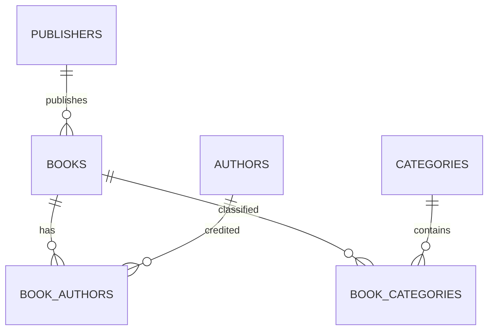
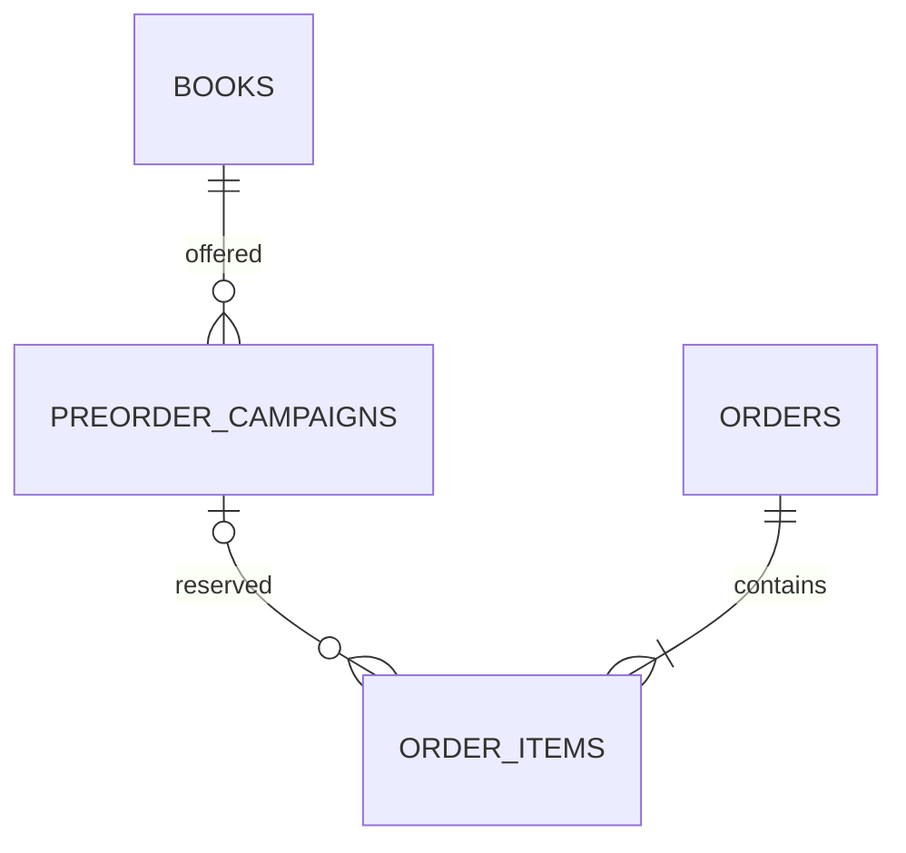
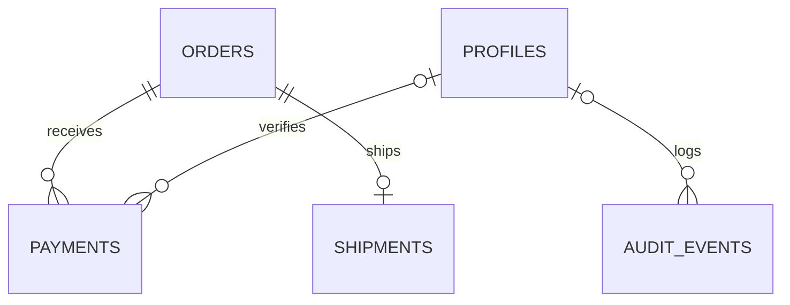
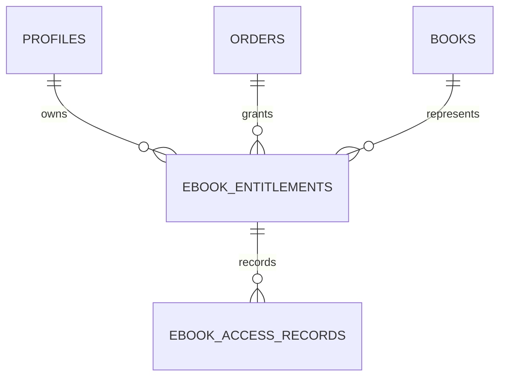

# Module-level ERD segments

All nodes below map to implemented database tables. AUTH_USERS is Supabase-managed. See SCHEMA.md for attributes and constraints.

## Customer and order module

## Catalog module

## Preorder module

## Payment and shipping modules

## Ebook module

The full integrated ERD merges these segments using common PK/FK attributes; no duplicate customer/book entities are introduced.
