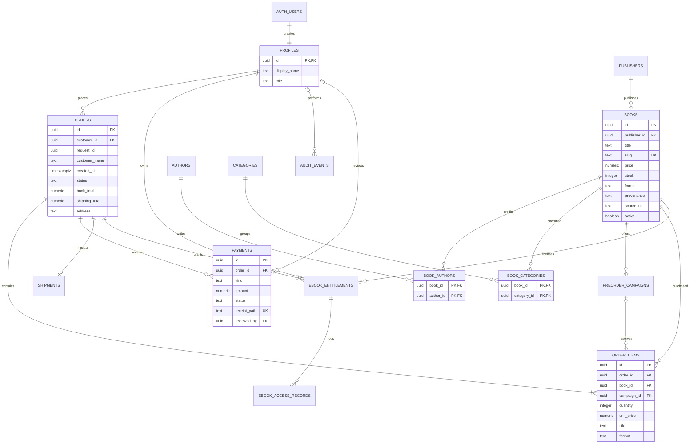

# Relational schema and data dictionary

PostgreSQL/Supabase. Migration: `supabase/migrations/001_fixihub.sql`. UUID primary keys unless specified; timestamps are timestamptz. MYR money uses numeric(10,2), not floating-point database columns. Required unless marked optional/default.

## Complete ERD

AUTH_USERS corresponds to Supabase’s existing auth.users table. RECEIPTS are Supabase storage.objects rows, referenced by immutable path rather than a foreign key to an implementation-owned storage UUID. catalog is a security-invoker SQL view, not a duplicate table.

## Tables / every implemented attribute

| Table                | Attributes and constraints                                                                                                                                                                                                                                                                       |
| -------------------- | ------------------------------------------------------------------------------------------------------------------------------------------------------------------------------------------------------------------------------------------------------------------------------------------------ |
| profiles             | id PK/FK auth.users ON DELETE CASCADE; display_name text 1–100 chars; role customer/admin, default customer                                                                                                                                                                                      |
| publishers           | id PK; name text UNIQUE; website optional text; established_year optional integer; source_url optional text                                                                                                                                                                                      |
| authors              | id PK; name text UNIQUE                                                                                                                                                                                                                                                                          |
| categories           | id PK; name text UNIQUE                                                                                                                                                                                                                                                                          |
| books                | id PK; publisher_id FK publishers; title text 1–160 chars; slug UNIQUE text; price numeric(10,2)>0; stock integer>=0 default 0; color hex text; description text default empty; format physical/ebook; source_url optional text; provenance public_metadata/demo; active boolean default true    |
| book_authors         | book_id FK books ON DELETE CASCADE + author_id FK authors form composite PK                                                                                                                                                                                                                      |
| book_categories      | book_id FK books ON DELETE CASCADE + category_id FK categories form composite PK                                                                                                                                                                                                                 |
| preorder_campaigns   | id PK; book_id FK; title text; opens_at, closes_at, release_at timestamps; capacity positive integer; reserved integer default 0 within capacity; active default true; opening < closing <= release; one active row/book                                                                         |
| orders               | id PK; customer_id FK profiles; request_id uuid; customer_name text snapshot; created_at default now; status awaiting_payment/processing/shipped/completed; book_total positive numeric; shipping_total nonnegative numeric; address snapshot text default empty; UNIQUE(customer_id,request_id) |
| order_items          | id PK; order_id FK; book_id FK; optional campaign_id FK; quantity integer 1–10; unit_price positive numeric; title and format snapshots; UNIQUE(order_id,book_id)                                                                                                                                |
| payments             | id PK; order_id FK; kind book/shipping; amount positive numeric; status pending/verified/rejected; receipt_path UNIQUE text; note default empty; created_at default now; optional reviewed_by FK profiles; optional reviewed_at timestamp; partial unique order/kind for pending and verified    |
| shipments            | order_id PK/FK orders; tracking_number text 3–120 chars; shipped_at default now; delivered_at optional                                                                                                                                                                                           |
| ebook_entitlements   | id PK; customer_id FK profiles; book_id FK; order_id FK; active default true; created_at default now; UNIQUE(order_id,book_id)                                                                                                                                                                   |
| ebook_access_records | id PK; entitlement_id FK; created_at default now; outcome text default metadata_only_no_licensed_file                                                                                                                                                                                            |
| audit_events         | id bigint generated identity PK; optional actor_id FK profiles; action text; optional record_id uuid; detail jsonb default {}; created_at default now                                                                                                                                            |

## Cardinalities and optionality

- A profile may place zero or many orders; every order has one customer.
- An order has one or more items through the checkout transaction. Individual inserts cannot bypass the RPC through the API.
- A book can have multiple authors and categories, including none at the database level. The application’s catalog form requires one author/category and replaces the links on save; multi-author/category bulk editing is not supplied.
- An item either references one preorder campaign or none; the RPC verifies campaign/book consistency.
- A physical order has no shipment until fulfillment, then exactly one. Digital-only orders need none.
- An order can have many rejected receipt attempts but at most one pending and one verified receipt for each payment type.
- An ebook entitlement has exactly one customer/book/order. RPCs enforce that the customer is the order owner and the book is a paid digital line.
- Access events belong to one entitlement and cannot be created for another reader.
- Reviewer is optional until a payment decision; audit actor is the authenticated actor in implemented transactions.

## Indexes and access paths

Composite PK indexes implement the join tables. Additional indexes cover orders.customer_id, order_items.order_id, payments.order_id, ebook_entitlements.customer_id and ebook_access_records.entitlement_id. Unique indexes enforce idempotency, one active campaign, receipt uniqueness and verified/pending payment uniqueness.

Foreign keys use restrictive deletion for transactional history. The UI archives books instead of deleting them. Auth deletion with referenced orders is intentionally blocked by FKs; production data-erasure procedures require a retention/anonymization policy.

## RLS and RPC matrix

| Surface                               | Anonymous | Customer                          | Administrator                        |
| ------------------------------------- | --------- | --------------------------------- | ------------------------------------ |
| Catalog + active campaigns + metadata | Read      | Read                              | Read including archived              |
| Profiles                              | None      | Own read; name-only update RPC    | All read                             |
| Orders/items/payments/shipments       | None      | Own read, checkout/upload RPCs    | All read, review/fulfill RPCs        |
| Entitlements/access records           | None      | Own read, active access-check RPC | All read                             |
| Audit events                          | None      | None                              | Read                                 |
| Catalog/campaign mutation             | None      | None                              | Role-checked RPC                     |
| Receipt Storage                       | None      | Insert/read owned order paths     | Read all receipts                    |
| Role promotion                        | None      | None                              | Not through app; database owner only |

Every public table has RLS. Direct client mutation grants are revoked. Function EXECUTE is revoked from PUBLIC and anon; only named authenticated functions are granted. Read paths use auth.uid() ownership checks or is_admin(). No client is given a service-role key.
