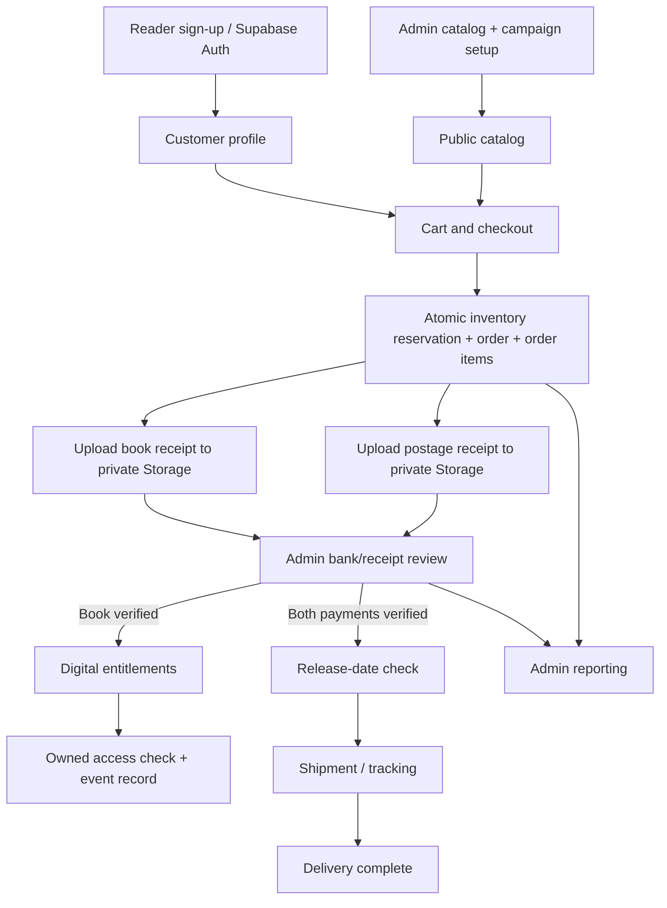

# Major transaction modules

| Module               | Actor / inputs                                                            | Reads/writes                                                                        | Result and constraints                                                                           |
| -------------------- | ------------------------------------------------------------------------- | ----------------------------------------------------------------------------------- | ------------------------------------------------------------------------------------------------ |
| Customer management  | Visitor: name/email/password; customer: updated name                      | Supabase auth.users; profiles                                                       | Confirmed identity, customer role; profile update cannot alter role                              |
| Catalog management   | Admin: title, author, category, format, price, stock, description, colour | publishers, books, authors, categories, book_authors, book_categories, audit_events | Add/edit/archive; positive price and valid stock; original placeholder covers                    |
| Preorder management  | Admin: book, dates, capacity, active flag                                 | books, preorder_campaigns, audit_events                                             | One active campaign/book, coherent dates; capacity cannot drop below reservations                |
| Order checkout       | Customer: bag, address, idempotency UUID                                  | profiles, books, preorder_campaigns, orders, order_items, audit_events              | Atomic reservation and authoritative totals; duplicate retries do not consume inventory twice    |
| Receipt submission   | Customer: order, payment kind, file                                       | private storage.objects, orders, payments                                           | Storage upload first, then receipt RPC; owner/order binding; duplicate pending submission denied |
| Payment verification | Admin: payment, approve/reject, note                                      | payments, orders, order_items, ebook_entitlements, audit_events                     | State transition and ebook grant in one transaction                                              |
| Shipping             | Admin: order, tracking or delivered flag                                  | orders, order_items, campaigns, payments, shipments, audit_events                   | All settlement/release gates enforced, tracking stored                                           |
| Ebook access         | Customer: entitlement ID                                                  | ebook_entitlements, ebook_access_records                                            | Owned active entitlement required; records check without supplying files                         |
| Reporting            | Admin: workspace data                                                     | Orders/items/payments/profiles under RLS                                            | Accurate ordered-value vs collected-value distinction; CSV export                                |

## Data flow

## Transaction integrity

`checkout` locks the customer for idempotency, then book rows in stable ID order and associated campaigns. All reservations and inserts are in one database transaction. A failure at any point rolls back inventory changes.

`review_payment` locks the payment then order; status update, ebook grant and audit event commit together. Unique indexes prevent duplicate verified payments or grants. `fulfill_order` locks the order and checks verified records/release times.

Storage upload is not part of the database transaction. If submit_receipt fails after upload, an unreferenced object may remain. No customer overwrite/delete permission is granted. Operators may periodically delete unreferenced objects after a retention review; never delete referenced receipts.

RLS is checked independently of UI visibility. Privileged functions are SECURITY DEFINER with fixed search_path, explicit auth/role checks and restricted execution grants. All client-supplied IDs and amounts are untrusted.
